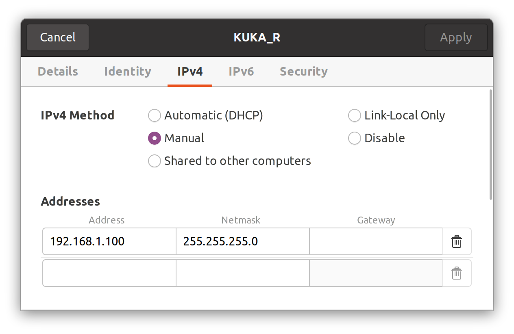

Код реализованной программы расположен в scripts/kuka_point_aruco42.py

## Подключение к роботу

0. Подключите Ethernet кабель и настройте соединение

ip. 192.168.1.100 255.255.255.0
1. Запустите программу
```bash
roslaunch kuka_rsi_hw_interface test_hardware_interface.launch sim:=false
```
2. На роботе запустите программу ros_rsi.src. При достижения Attention!!! переведите робота в Auto режим. Нажмите OK. И продолжите запуск программы.
При успешном подключении появится сообщение в первом терминале

4. Запустите move_group для управления роботом с помощью Moveit
```bash
roslaunch real_kuka_kr3_moveit_config move_group.launch
```
5. Для визуализации запустите rViz (не забудьте прописать source devel/setup.bash)
```bash
rviz
```
6. В rViz добавьте добавьте панель MotionPlanning. Измените Fixed Frame на base_link

7. Запуск реализованной программы (вычисление точки над маркером и реализация захвата)

```bash
python3 scripts/kuka_point_aruco42.py
```


## Тестирование программ в симуляции

1. Запустите demo.launch. Эта программа не привязана к реальному роботу
```bash
roslaunch real_kuka_kr3_moveit_config demo.launch
```
2. Далее можно запускать существующую программу
```bash
python3 scripts/kuka_point_aruco42.py
```
